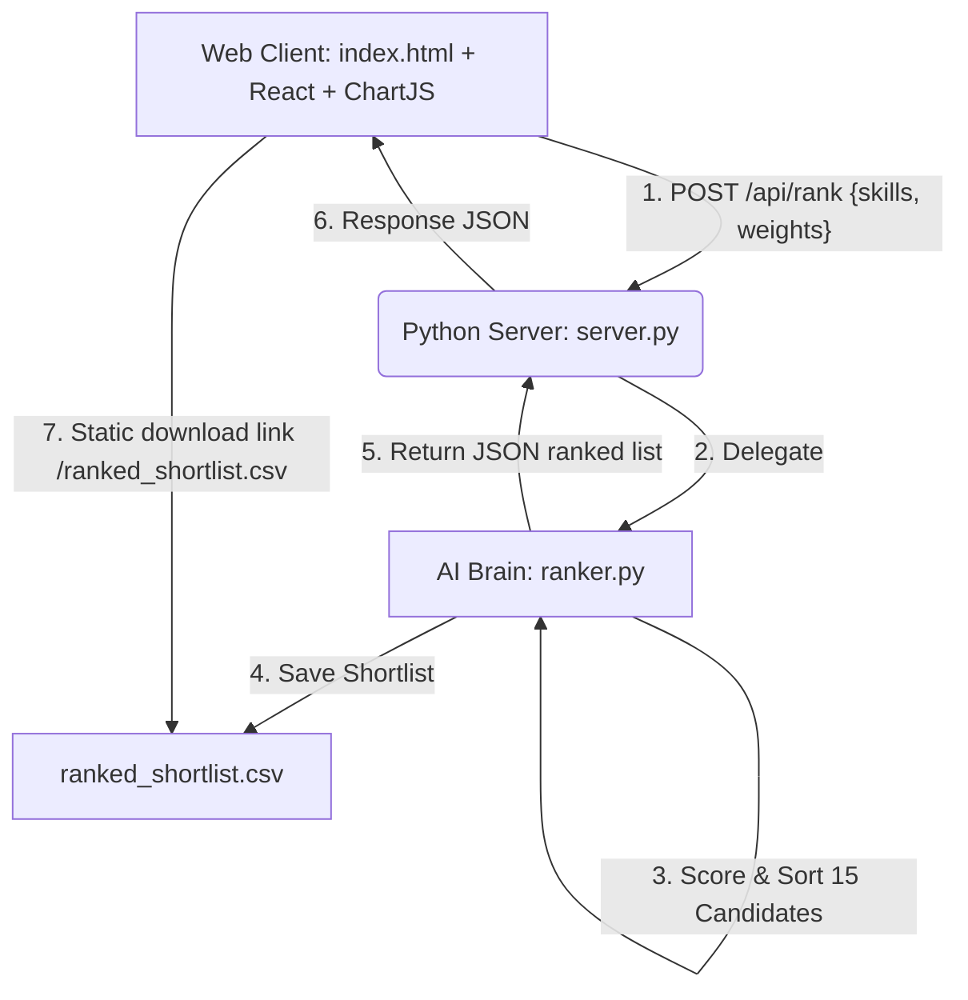

# SkillMatch: Predictive Ranking Engine & Candidate Discovery

**Track 01 - The Data & AI Challenge (Intelligent Candidate Discovery)**

SkillMatch is a robust, workable Proof of Concept built to solve the modern talent acquisition challenge. By moving beyond naive keyword matching, SkillMatch implements a **Python-powered Predictive Ranking Engine** that dynamically score-ranks candidates based on semantic skill proximity, professional experience metadata, and crucial behavioral intent signals.

---

## 1. Project Overview & "Hidden Gems" Strategy

Traditional applicant tracking systems (ATS) drop qualified candidates if they lack specific keyword tokens (e.g., matching "React" but missing a candidate who is highly skilled in "Vue.js" or "Svelte"). 

SkillMatch implements an **AI Brain** that:
- **Sees beyond keywords**: Employs synonym mappings to award partial matching scores for related frameworks/libraries.
- **Integrates behavioral metadata**: Combines active job search intent, recruiter email responsiveness, and GitHub project contributions to rank highly engaged candidates.
- **Promotes Explainable AI**: Presents clear, mathematical breakdowns of the fit coefficient, enabling recruiters to adjust weights dynamically.

---

## 2. Mathematical Scoring Model

The ranking engine computes a composite match score ($Score_{composite}$) between **0.0% and 100.0%** for each applicant using four weighted dimensions. 

Recruiters can adjust the matching weights ($w_i$) interactively in the UI, and the Python backend recomputes the score on-the-fly:

$$Score_{composite} = w_{semantic} \cdot S_{semantic} + w_{assessment} \cdot S_{assessment} + w_{behavioral} \cdot S_{behavioral} + w_{career} \cdot S_{career}$$

Where:
$$\sum w_i = w_{semantic} + w_{assessment} + w_{behavioral} + w_{career} = 1.0$$

### Scoring Component Breakdown

#### A. Semantic Stack Proximity ($S_{semantic}$)
Matches the candidate's skills against job requirements. If a direct match is missing, the engine checks a synonym proximity matrix. Example synonym mappings:
* **React** $\leftrightarrow$ Vue.js (80%), Svelte (85%), Angular (70%), JavaScript (60%)
* **Node.js** $\leftrightarrow$ Express (90%), FastAPI (70%), Go (70%)
* **Machine Learning** $\leftrightarrow$ Deep Learning (95%), PyTorch (90%), TensorFlow (90%), RAG (85%)
$$S_{semantic} = \frac{\sum_{r \in Required} \text{MaxSimilarity}(r, \text{CandidateSkills})}{\text{Total Required Skills}} \times 100$$

#### B. Coding Assessment Score ($S_{assessment}$)
Integrates candidate performance on technical logic tests directly from the assessment suite (0% - 100%).

#### C. Behavioral Intent Score ($S_{behavioral}$)
Aggregates activity signals to target high-engagement applicants:
* **Search Intent**: Active (100 pts), Semi-Active (70 pts), Passive (40 pts).
* **Responsiveness**: Recruiter outreach response rate percentage (0 - 100).
* **GitHub Activity Index**: Annual public repository commit velocity (capped at 400 commits/yr).
$$S_{behavioral} = \frac{\text{IntentScore} + \text{Responsiveness} + \min(100, \frac{\text{Commits}}{4} )}{3}$$

#### D. Career & Stability Score ($S_{career}$)
Prevents high-churn hires while ensuring experience thresholds:
* **Experience Fit**: Ratio of years of experience vs target job seniority requirement (capped at 100%).
* **Promotion/Growth Velocity**: Dynamic career growth and seniority progression index (0 - 100).
* **Job Stability Index**: Ratio of average job tenure length vs a standard 2.5-year baseline (capped at 100%).
$$S_{career} = \frac{\text{ExpRatio} + \text{GrowthVelocity} + \min(100, \frac{\text{AvgTenure}}{2.5} \times 100 )}{3}$$

---

## 3. System Architecture

The application is built as a hybrid client-server platform with **zero external package dependencies**, ensuring out-of-the-box execution:



* **Frontend UI**: Responsive glassmorphism dashboard built using React (htm template bindings) and Chart.js. Includes matching coefficient range sliders and explainable AI breakdowns.
* **REST API Layer (`server.py`)**: Built-in Python TCP server extended to route API endpoints (`/api/rank`, `/api/candidates`) and handle preflight CORS requests.
* **AI Brain (`ranker.py`)**: Python calculation engine conducting the similarity scoring matrix and compiling the CSV candidate leaderboard.

---

## 4. Predefined Shortlist Export Format

When the ranking engine runs, it automatically writes the results to `ranked_shortlist.csv` in the root workspace directory. The CSV uses the following predefined format:

| Column | Description |
| :--- | :--- |
| `Rank` | Position on the candidate leaderboard (1-indexed) |
| `Candidate ID` | Unique candidate identifier |
| `Name` | Applicant full name |
| `Job Title` | Current professional title |
| `Overall Match Score (%)` | Composite score ($Score_{composite}$) |
| `Semantic Fit (%)` | Technical stack synonym mapping score |
| `Coding Challenge (%)` | Logic assessment score |
| `Behavioral Score (%)` | Sourcing intent + responsiveness + git index |
| `Career Score (%)` | Stability + experience + growth metrics |
| `Sourcing Intent` | Candidate search intent (Active / Semi-Active / Passive) |
| `Outreach Responsiveness (%)` | Recruiter contact response rate |
| `GitHub Commits/Yr` | Public contribution velocity |
| `Exp (Yrs)` | Total professional coding experience |
| `Average Tenure (Yrs)` | Average job tenure |
| `Recommendation` | AI-generated candidate assessment summary |

---

## 5. Getting Started & Execution Guide

### Prerequisites
* Python 3.x installed (Uses only Python built-in standard libraries).
* A modern web browser.

### Run Instructions
1. Run the local launch script:
   ```bash
   run.bat
   ```
2. The script will boot the Python static/REST API server on port **8000** and output:
   ```text
   ===================================================
             SkillMatch Recruitment Platform
   ===================================================
   Server started on port 8000 (IPv4)...
   Serving files with caching disabled...
   ```
3. Open your browser and navigate to:
   ```text
   http://127.0.0.1:8000
   ```
4. Click **"Try Demo"** to load the workspace, or upload a custom job description and ingest resumes.
5. In the **"Talent Leaderboard"** tab, adjust the range sliders to change weights. The candidate ranks, charts, and CSV file will update automatically.
6. Click **"Export Predefined CSV"** to download the shortlist.
* Project Direct Link: https://ranking-yt0l.onrender.com/
